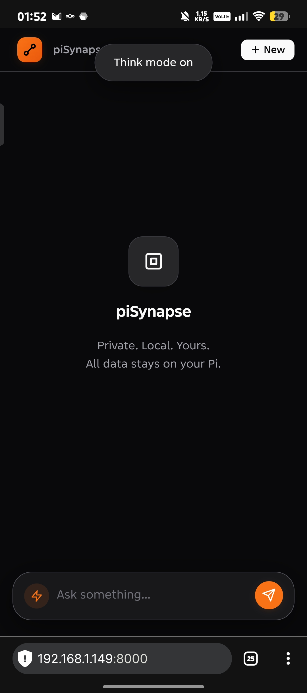
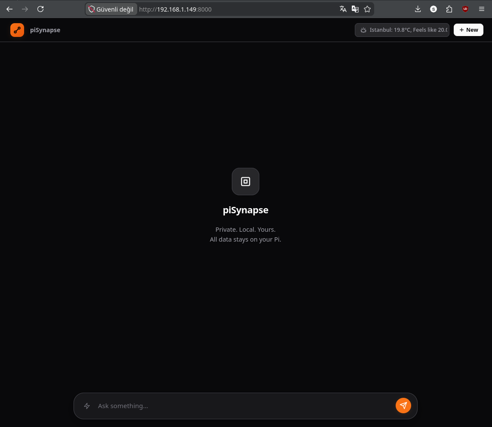
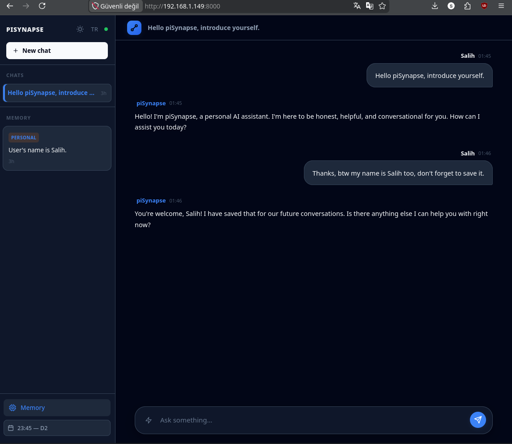

# piSynapse

**Privacy-first, self-hosted personal AI assistant.**

piSynapse runs entirely on your own hardware — no subscriptions, no cloud, no data leaving your machine. It connects your calendar, email, and local LLM into a single conversational interface.

---

## Philosophy

Most AI assistants require handing your data to someone else's infrastructure. piSynapse doesn't. Your conversations, memories, calendar events, and emails stay on your device. The project is licensed under **GNU GPLv3**, so it can't be quietly closed or commercialized down the line.

It runs well on a Raspberry Pi 5 — that's the primary hardware it's been developed and tested on — but there's nothing stopping you from running it on any Linux machine.

---

## Features

- 💬 **Web UI** — Clean chat interface with session management, memory panel, and think mode toggle
- 📅 **Calendar** — Nextcloud CalDAV integration for schedule management
- 📧 **Email** — Gmail IMAP/SMTP (read, send, search)
- 🌤️ **Weather** — Real-time forecasts via Open-Meteo, no tracking
- 🧠 **Long-Term Memory** — Semantic search and deduplication using local embeddings
- 🤖 **Local LLM** — Ollama with native tool calling

---

## Tech Stack

| Component | Technology |
|-----------|-----------|
| **API** | FastAPI (async Python) |
| **LLM** | Ollama + local models |
| **Tool Calling** | Ollama native tool calling (JSON schema) |
| **Storage** | SQLite + aiosqlite |
| **Embeddings** | FastEmbed (runs locally) |
| **Integrations** | Nextcloud CalDAV, Gmail IMAP/SMTP |
| **Weather** | Open-Meteo API |

---

## Project Structure

```
piSynapse/
├── main.py              # FastAPI app, startup & lifespan
├── llm.py               # Ollama bridge, tool runner, system prompt
├── memory.py            # Conversation history & long-term memory
├── embedding.py         # Semantic embeddings (FastEmbed)
├── gmail.py             # Gmail async wrapper
├── nextcloud_auth.py    # CalDAV client
├── install.py           # Interactive setup wizard
├── example.env          # Configuration template
├── requirements.txt
├── LICENSE
├── static/
│   └── index.html       # Web UI (single file, no build step)
└── routers/
    └── chat.py          # Chat API endpoints
```

---

## Getting Started

### Quick Start

```bash
git clone https://github.com/selfhoster-sh/piSynapse.git
cd piSynapse
python install.py
```

The installer checks your Python version, installs Ollama if needed, creates a virtual environment, installs dependencies, and walks you through `.env` configuration.

### Manual Setup

```bash
# 1. Install Ollama and pull a model
curl https://ollama.com/install.sh | sh
ollama pull gemma4:e2b

# 2. Clone and install dependencies
git clone https://github.com/selfhoster-sh/piSynapse.git
cd piSynapse
python3 -m venv .venv
source .venv/bin/activate
pip install -r requirements.txt

# 3. Configure
cp example.env .env
nano .env

# 4. Run
python -m uvicorn main:app --host 0.0.0.0 --port 8000
```

Then open `http://localhost:8000` in your browser.

---

## Configuration

Key settings in `.env`:

```env
# LLM
OLLAMA_BASE_URL=http://localhost:11434
LLM_MODEL=gemma4:e2b
LLM_TEMPERATURE=0.3
LLM_KEEP_ALIVE=24h

# Gmail (optional)
GMAIL_USER=your@gmail.com
GMAIL_APP_PASSWORD=xxxx-xxxx-xxxx-xxxx

# Nextcloud (optional)
NEXTCLOUD_URL=https://cloud.example.com
NEXTCLOUD_USER=username
NEXTCLOUD_PASSWORD=app-password

# Personalization
ASSISTANT_USER=Your Name
DEFAULT_CITY=Istanbul

# Memory & History
HISTORY_LIMIT=12
MEMORY_LIMIT=10
MEMORY_SIMILARITY_THRESHOLD=0.68
```

**Gmail:** Enable 2FA and generate an [App Password](https://myaccount.google.com/apppasswords).  
**Nextcloud:** Create a dedicated [App Password](https://docs.nextcloud.com/server/latest/user_manual/en/session_management.html#app-passwords) in Security settings.

---

## API

```bash
# Chat
curl -X POST http://localhost:8000/chat \
  -H "Content-Type: application/json" \
  -d '{"message": "What'\''s on my calendar today?", "session_id": "main"}'

# List memories
curl http://localhost:8000/chat/memories?user_id=default

# Clear a session
curl -X DELETE "http://localhost:8000/chat/history?session_id=main"

# Health check
curl http://localhost:8000/health
```

---

## Roadmap

- [x] **Web UI** — Chat interface with sessions, memory panel, weather/calendar widgets
- [ ] **Proton Mail** — Integration via proton-bridge
- [ ] **Voice I/O** — Speech-to-text and text-to-speech
- [ ] **Mobile App** — Android companion app
- [ ] **Multi-user** — Separate memory and sessions per user

---
## Screenshots




---
## License

GNU General Public License v3.0 — see [LICENSE](LICENSE).

piSynapse is free and open-source, and the license ensures it stays that way.

---

## Contributing & Support

Issues and pull requests welcome on [GitHub](https://github.com/selfhoster-sh/piSynapse/issues).
