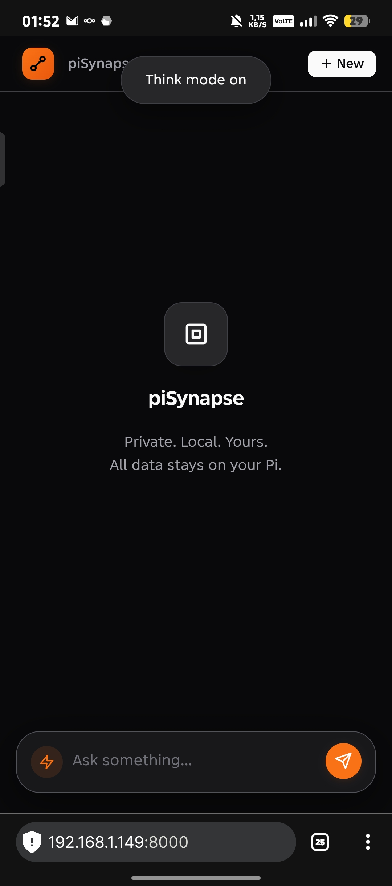
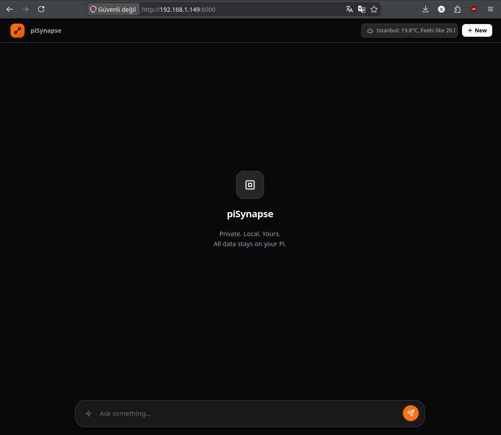
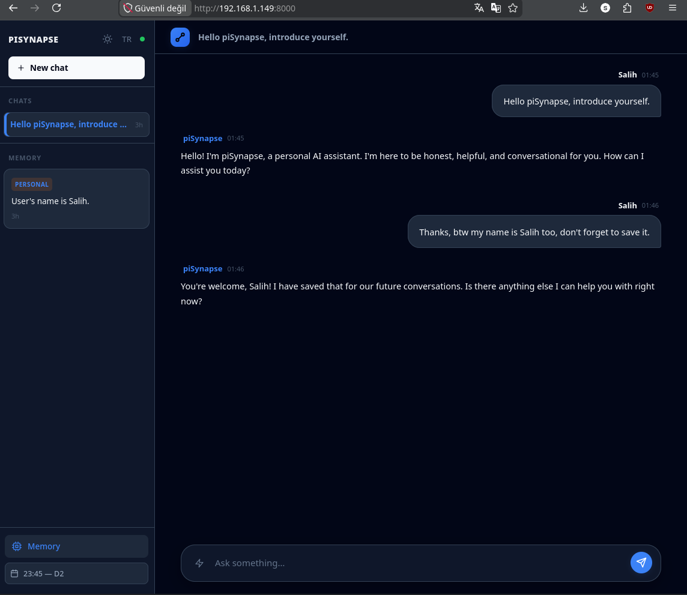

# piSynapse

[](https://github.com/selfhoster-sh/piSynapse/actions)

**Privacy-first, self-hosted personal AI assistant.**

piSynapse runs entirely on your own hardware — no subscriptions, no cloud, no data leaving your machine. It connects your calendar, email, notes, tasks, and local LLM into a single conversational interface.

> **Why the name?** *pi* stands for **p**rivate **i**ntelligence — and a *synapse* is where neurons connect. Your data, your memory, and your tools all meet in one private place: your own machine.

---

## Philosophy

Most AI assistants require handing your data to someone else's infrastructure. piSynapse doesn't. Your conversations, memories, calendar events, notes, tasks, and emails stay on your device. The project is licensed under **GNU GPLv3**, so it can't be quietly closed or commercialized down the line.

It runs well on a Raspberry Pi 5 — that's the primary hardware it's been developed and tested on — but there's nothing stopping you from running it on any Linux machine.

### Privacy & External Services

piSynapse is designed to work **100% locally**. All external service integrations are **optional** and opt-in:

| Integration | Purpose | Data leaving your device? |
|-------------|---------|--------------------------|
| **Open-Meteo** | Weather forecasts | City name only (no location tracking) |
| **Nominatim** | City → coordinates geocoding | City name only |
| **Gmail SMTP/IMAP** | Email read/send | Email content (requires your credentials) |
| **ProtonBridge** | ProtonMail read/send | Email content (runs locally, bridge talks to Proton servers) |
| **Nextcloud** | Calendar, notes, tasks | Data stays on your Nextcloud server (self-hosted or trusted provider) |

When you disable all external integrations, **zero data leaves your device**. No telemetry, no analytics, no phone-home.

---

## Features

- 💬 **Web UI** — Clean chat interface with session management, memory panel, think mode, and multi-language support (EN/TR)
- 📅 **Calendar** — Nextcloud CalDAV integration for schedule management
- 📧 **Email** — Gmail and ProtonMail (via ProtonBridge) read/send/search
- 📝 **Notes** — Nextcloud Notes create/read/update/delete/search with offline cache
- ✅ **Tasks** — Nextcloud Tasks via CalDAV VTODO — create/list/complete/delete/search
- 🌤️ **Weather** — Real-time forecasts via Open-Meteo (no tracking)
- 🧠 **Long-Term Memory** — Semantic search and deduplication using local embeddings
- 🎤 **Voice Input** — Whisper (fast/accurate) or Gemma4 native audio transcription
- 🔊 **Voice Output** — Piper TTS (local/offline) or browser Web Speech API
- 🖼️ **Image Upload** — Drag-and-drop, paste, or attach images to send to the model
- 🎨 **Themes** — 5 accent colors on a dark UI
- 🔐 **API Key Auth** — Token-based access with rate limiting
- 📱 **PWA** — Installable on mobile and desktop with offline caching
- 🤖 **Local LLM** — LiteRT or Ollama backend with intent classification and tool calling

---

## Tech Stack

| Component | Technology |
|-----------|-----------|
| **API** | FastAPI (async Python) |
| **LLM** | LiteRT-LM or Ollama (configurable via `LLM_BACKEND`) |
| **Tool Calling** | LLM-native function calling (JSON schema) |
| **Intent Classification** | Lightweight LLM call (5 tokens) + embedding similarity |
| **Storage** | SQLite + aiosqlite |
| **Embeddings** | FastEmbed (local ONNX) |
| **Email** | Gmail IMAP/SMTP, ProtonMail via ProtonBridge |
| **Calendar/Tasks** | Nextcloud CalDAV (python-caldav) |
| **Notes** | Nextcloud REST API |
| **TTS** | Piper (local), Web Speech API (browser) |
| **STT** | Whisper, Gemma4 native audio |
| **Weather** | Open-Meteo API |

---

## Hardware Requirements

| Resource | Minimum | Recommended |
|----------|---------|-------------|
| **RAM** | 4 GB | 8 GB+ |
| **Storage** | 8 GB free | 16 GB+ (model + voice files) |
| **CPU** | 4 cores (ARM or x86) | 8 cores |
| **Network** | Internet (for initial setup only) | Internet |

- **zRAM** is strongly recommended on low-RAM devices (Raspberry Pi 5, etc.). It compresses memory pages in real time and can reduce memory pressure by 30–50%.
- The LLM model (Gemma4 E2B ~2.4 GB or E4B ~3.4 GB) is loaded into RAM and stays resident while the server is running. On 8 GB devices, budget accordingly.
- Piper TTS voices add ~60 MB per voice.

---

## Project Structure

```
piSynapse/
├── main.py              # FastAPI app, middleware, security, lifespan
├── config.py            # Settings, SETTINGS_SCHEMA, sync_config()
├── prompt.py            # System prompt builder (per-request)
├── db.py                # SQLite with WAL mode and auto-reconnect
├── embedding.py         # Semantic embeddings (FastEmbed ONNX)
├── mail.py              # Gmail and ProtonMail clients
├── calendar_ops.py      # CalDAV calendar events (singleton)
├── nextcloud_notes.py   # Nextcloud Notes REST API client
├── nextcloud_tasks.py   # Nextcloud Tasks CalDAV client
├── weather.py           # Open-Meteo + Nominatim geocoding
├── utils.py             # Retry decorator, text helpers
├── install.py           # Interactive setup wizard
├── example.env          # Configuration template
├── requirements.txt
├── LICENSE
├── llm/                 # LLM bridge — chat, stream, intent, payload
│   ├── __init__.py
│   ├── chat.py
│   ├── stream.py
│   ├── intent.py
│   ├── payload.py
│   └── utils.py
├── tools/               # Tool definitions and dispatcher
│   ├── __init__.py
│   ├── definitions.py
│   └── dispatcher.py
├── models/              # ONNX embedding models (auto-downloaded)
├── static/
│   ├── index.html       # Full SPA (no build step)
│   ├── sw.js            # Service worker for PWA
│   ├── manifest.json    # PWA manifest
│   ├── piSynapse_Icon.svg
│   ├── fonts/           # DM Sans (bundled locally)
│   └── *.png            # PWA icons
└── routers/
    ├── chat.py          # Chat, session, memory, execute endpoints
    ├── media.py         # Transcription and TTS endpoints
    ├── config.py        # Settings API with file locking
    └── widgets.py       # Weather/calendar sidebar widgets
```

---

## Getting Started

### Quick Start

```bash
git clone https://github.com/selfhoster-sh/piSynapse.git
cd piSynapse
python install.py
```

The installer:

1. Checks your Python version (3.10+ required).
2. Installs system dependencies (ffmpeg, build tools).
3. Creates a Python virtual environment and installs dependencies.
4. Lets you choose an LLM backend: **LiteRT-LM** (recommended — imports models from HuggingFace) or **Ollama** (downloads via `ollama pull`).
5. Downloads Piper TTS voices (optional — Turkish and English).
6. Walks you through `.env` configuration: email (choose **ProtonMail via ProtonBridge** or **Gmail with App Password**), Nextcloud, weather, voice, and personalization.
7. Optionally creates systemd services for auto-start on boot.

### Manual Setup

```bash
# 1. Install LLM backend (pick one)
#    LiteRT-LM:
#      pip install litert-lm && litert-lm serve --port 9379
#      litert-lm import --from-huggingface-repo litert-community/gemma-4-E2B-it-litert-lm gemma-4-E2B-it.litertlm gemma4-e2b
#
#    Or Ollama:
#      curl https://ollama.com/install.sh | sh && ollama pull gemma4:e2b

# 2. Clone and install dependencies
git clone https://github.com/selfhoster-sh/piSynapse.git
cd piSynapse
python3 -m venv venv
source venv/bin/activate
pip install -r requirements.txt

# 3. Choose email provider
#    Option A — ProtonMail (requires ProtonBridge running locally):
#      cp example.env .env
#      Then set: MAIL_PROVIDER=proton, PROTON_USER, PROTON_PASSWORD
#
#    Option B — Gmail (requires App Password):
#      cp example.env .env
#      Then set: MAIL_PROVIDER=gmail, GMAIL_USER, GMAIL_APP_PASSWORD
#
#    Option C — No email (leave MAIL_PROVIDER unset all values empty):

# 4. Edit configuration
nano .env

# 5. Run
python -m uvicorn main:app --host 0.0.0.0 --port 8765
```

Then open `http://<your-pi-ip>:8765` in your browser. The installer can also create a `pisynapse.service` systemd unit that runs on port 8765 and starts on boot.

---

## Configuration

All settings are in `.env`. See [`example.env`](example.env) for the full list with documentation. Key settings:

| Variable | Description | Default |
|----------|-------------|---------|
| `LLM_BACKEND` | Backend: `litert` or `ollama` | `ollama` |
| `LLM_MODEL` | Model name | `gemma4-e2b` |
| `LITERT_BASE_URL` | LiteRT server URL | `http://localhost:9379` |
| `OLLAMA_BASE_URL` | Ollama server URL | `http://localhost:11434` |
| `API_KEY` | Auth key (auto-generated by installer) | — |
| `MAIL_PROVIDER` | `gmail`, `proton`, or leave empty (disabled) | `—` (disabled) |
| `GMAIL_USER` | Gmail address | — |
| `GMAIL_APP_PASSWORD` | Gmail App Password (16 chars, no spaces) | — |
| `PROTON_USER` | ProtonMail address | — |
| `PROTON_PASSWORD` | ProtonBridge password | — |
| `NEXTCLOUD_URL` | Nextcloud server URL | — |
| `NEXTCLOUD_USER` | Nextcloud username | — |
| `NEXTCLOUD_PASSWORD` | Nextcloud app password | — |
| `ASSISTANT_USER` | Your name | `default` |
| `DEFAULT_CITY` | City for weather | — |
| `STT_ENGINE` | `whisper`, `gemma4`, or `browser` | `whisper` |
| `TTS_ENGINE` | `piper` or `browser` | `piper` |
| `TTS_VOICE` | Piper voice model | `en_US-lessac-medium` |

**Gmail:** Enable 2FA and generate an [App Password](https://myaccount.google.com/apppasswords).
**ProtonMail:** Install [ProtonBridge](https://proton.me/mail/bridge), enable bridge, set SMTP credentials in `.env`.
**Nextcloud:** Create a dedicated [App Password](https://docs.nextcloud.com/server/latest/user_manual/en/session_management.html#app-passwords) in Security settings.

---

## API

```bash
# Chat (streaming SSE)
curl -X POST http://localhost:8765/chat/stream \
  -H "Content-Type: application/json" \
  -H "X-API-Key: YOUR_API_KEY" \
  -d '{"message": "What'\''s on my calendar today?", "session_id": "main"}'

# Chat (non-streaming)
curl -X POST http://localhost:8765/chat/ \
  -H "Content-Type: application/json" \
  -H "X-API-Key: YOUR_API_KEY" \
  -d '{"message": "Hello!", "session_id": "main"}'

# Execute a tool directly (bypass LLM)
curl -X POST http://localhost:8765/chat/execute \
  -H "Content-Type: application/json" \
  -H "X-API-Key: YOUR_API_KEY" \
  -d '{"tool": "list_calendar_events", "params": {"days_ahead": 7}, "session_id": "test"}'

# List sessions
curl http://localhost:8765/chat/sessions \
  -H "X-API-Key: YOUR_API_KEY"

# Get conversation history
curl http://localhost:8765/chat/history?session_id=main \
  -H "X-API-Key: YOUR_API_KEY"

# Clear a session
curl -X DELETE "http://localhost:8765/chat/history?session_id=main" \
  -H "X-API-Key: YOUR_API_KEY"

# List memories
curl http://localhost:8765/chat/memories?user_id=default \
  -H "X-API-Key: YOUR_API_KEY"

# Delete all memories
curl -X DELETE "http://localhost:8765/chat/memories?user_id=default" \
  -H "X-API-Key: YOUR_API_KEY"

# Health check (no auth required)
curl http://localhost:8765/health
```

## Security Notes

- The server is intended for **trusted home LAN use**. API key auth protects the
  endpoints, but traffic is plain HTTP — the API key, the `/debug?k=` beacon
  token and all credentials the assistant relays (Proton mail, Nextcloud) travel
  in cleartext on the wire. Do **not** expose the server to the public internet
  or an untrusted network without a TLS reverse proxy (e.g. Caddy/nginx) in
  front.
- Keep `.env` permissions locked down (`chmod 600 .env`) — it contains mail,
  Nextcloud and API secrets.
- Rate limiting keys on the client IP. Behind a reverse proxy, set
  `TRUST_X_FORWARDED_FOR=1` so proxy-forwarded IPs are used; leave it unset
  (default) for direct access so clients cannot spoof their IP.

---

## Current Roadmap

- [x] **Web UI** — Chat interface with sessions, memory panel, weather/calendar widgets
- [x] **Proton Mail** — Read/send via ProtonBridge SMTP/IMAP
- [x] **Voice I/O** — Whisper/Gemma4 transcription, Piper TTS, Web Speech API
- [x] **Image Upload** — Drag-drop, paste, attach images
- [x] **PWA** — Installable on mobile and desktop
- [x] **Security** — API key auth, CORS, rate limiting, trusted-host enforcement
- [x] **Nextcloud Notes** — Create/read/update/delete/search
- [x] **Nextcloud Tasks** — CalDAV VTODO create/list/complete/delete/search
- [x] **Intent Classification** — LLM + embedding-based tool/no-tool routing
- [ ] **Nextcloud Contacts** — CardDAV contact search
- [ ] **Nextcloud News** — RSS feed integration

---

## Screenshots





---

## License

GNU General Public License v3.0 — see [LICENSE](LICENSE).

piSynapse is free and open-source, and the license ensures it stays that way.

---

## Contributing & Support

Issues and pull requests welcome on [GitHub](https://github.com/selfhoster-sh/piSynapse/issues).
